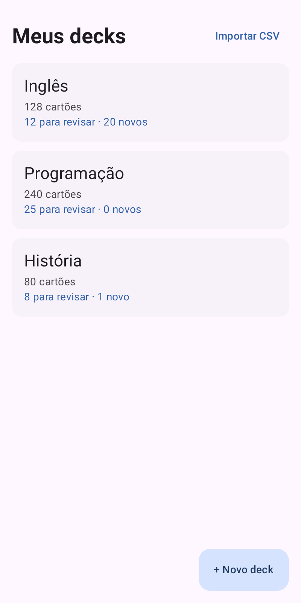
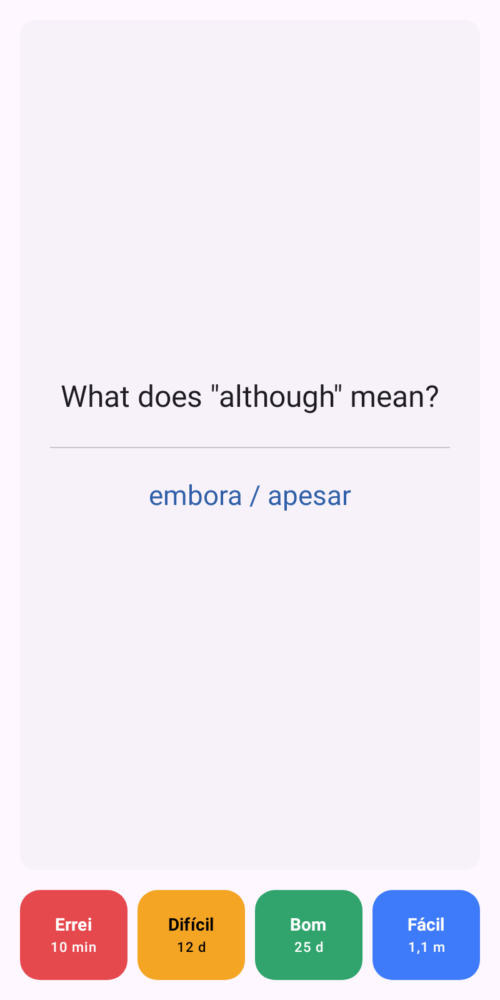
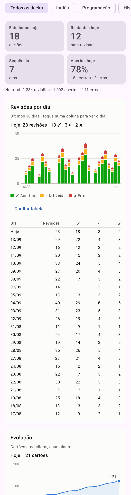
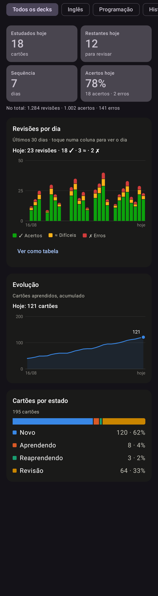

# Flashcards para Amazfit T-Rex 3

Flashcards com repetição espaçada: você cria e importa os baralhos no **Android** e
estuda **offline** no **Amazfit T-Rex 3**. As respostas voltam para o celular na
próxima sincronização.

| Home | Estudo | Estatísticas | Modo escuro |
|---|---|---|---|
|  |  |  |  |

*(Capturas geradas pelos testes, com dados de exemplo: `ScreenshotTest`.)*

## Como funciona

O T-Rex 3 roda **Zepp OS**, não Android. Por isso o projeto tem duas partes:

```
App Android (Kotlin)          Zepp App (oficial)                  Amazfit T-Rex 3
┌──────────────────────┐      ┌───────────────────────────┐       ┌────────────────────┐
│ decks, cartões, Room │ HTTP │ Side Service (JS)         │  BLE  │ Mini Program (JS)  │
│ estatísticas         │◄────►│ repassa pedidos ao celular│◄─────►│ estudo offline     │
│ servidor 127.0.0.1   │ local│ Settings App: código      │       │ fila de respostas  │
└──────────────────────┘      └───────────────────────────┘       └────────────────────┘
```

- A Zepp não oferece canal direto entre um app Android de terceiros e o relógio. A ponte é
  o **side service**, que roda dentro do Zepp App e chama um servidor HTTP local do app Android.
- O celular é a fonte da verdade. O relógio guarda uma cópia dos decks e uma **fila de
  respostas** (outbox). Na sincronização, o relógio envia as respostas, o celular recalcula
  cada cartão reproduzindo todas as revisões em ordem cronológica, e o relógio recebe só
  o que mudou.
- Detalhes: [docs/ARCHITECTURE.md](docs/ARCHITECTURE.md) (pesquisa da plataforma,
  decisões e limitações) e [docs/PROTOCOL.md](docs/PROTOCOL.md) (protocolo de sincronização).

## Estado do projeto

| Fase | |
|---|---|
| 1. Pesquisa da plataforma e arquitetura | ✅ |
| 2. Aplicativo Android básico | ✅ |
| 3. Banco de dados e decks | ✅ |
| 4. Flashcards e algoritmo de repetição | ✅ |
| 5. Interface Android | ✅ |
| 6. Aplicativo para o T-Rex 3 | ✅ |
| 7. Comunicação celular ↔ relógio | ✅ |
| 8. Sincronização | ✅ |
| 9. Estatísticas | ✅ |
| 10. Testes, otimização e documentação | ✅ |

**Testes:** 214 no Android (119 no `:core`, 95 no `:app`) e 67 no relógio, todos passando.
O pacote do relógio compila com o `zeus build`.

**Ainda não validado num T-Rex 3 real:** veja [Pontos a validar no relógio](#pontos-a-validar-no-relógio).

## Estrutura

```
android/                App Android (abra esta pasta no Android Studio)
  core/                 Kotlin puro: modelos, algoritmo SRS, sessão de estudo,
                        importador CSV, protocolo e servidor de sincronização, estatísticas
  app/                  Room, repositórios, telas Compose, foreground service de sincronização
watch/                  Mini Program Zepp OS
  page/                 telas do relógio: home, study, summary, sync
  lib/                  lógica em JS puro (SRS, sessão, armazenamento, sincronização)
  app-side/             side service (roda no Zepp App do celular)
  setting/              Settings App (código de pareamento, no Zepp App)
  test/                 testes em Node
shared/                 arquivos usados pelos testes Kotlin E JS:
  srs-test-vectors.json   casos de referência do algoritmo
  protocol-examples.json  exemplos de todas as mensagens do protocolo
sample-data/            CSVs de exemplo (inglês, programação, história)
docs/                   arquitetura, protocolo, capturas de tela
```

## Requisitos

- **Celular:** Android 8.0 (API 26) ou mais novo, com o **Zepp App** instalado e pareado ao T-Rex 3.
- **Computador:**
  - Android Studio (o JDK 21 que vem com ele serve), com o Android SDK plataforma **36.1** e o build-tools 36.0.0;
  - Node.js 18+ e o Zeus CLI (`npm i -g @zeppos/zeus-cli`);
  - conta Zepp (a mesma do Zepp App) para `zeus login`.

## 1. App Android

### Compilar e rodar os testes

No Windows (PowerShell):

```powershell
$env:JAVA_HOME = "C:\Program Files\Android\Android Studio\jbr"
cd android
.\gradlew.bat :core:test :app:testDebugUnitTest :app:assembleDebug
```

O APK sai em `android/app/build/outputs/apk/debug/app-debug.apk`. No Android Studio,
basta abrir a pasta `android/` e usar **Run**.

> **Erro `Unable to establish loopback connection`?** O Java não cria sockets locais quando
> a variável `TEMP` usa um nome curto do Windows (por exemplo, `C:\Users\ADMINI~1\...`).
> Rode antes de chamar o Gradle:
>
> ```powershell
> New-Item -ItemType Directory -Force "$env:USERPROFILE\.gtmp" | Out-Null
> $env:TEMP = "$env:USERPROFILE\.gtmp"; $env:TMP = $env:TEMP
> ```

### Instalar no celular

1. No celular, ative **Opções do desenvolvedor → Depuração USB**.
2. Conecte pelo USB e toque em **Permitir** no aviso "Permitir depuração USB?".
3. Instale:

```bash
adb install -r android/app/build/outputs/apk/debug/app-debug.apk
```

## 2. App do relógio

### Compilar e testar

```bash
cd watch
npm install
npm test
zeus build
```

O `zeus build` gera `watch/dist/*.zab`. O aviso que ele mostra sobre "intermediate products"
é da Zepp: se preferir não incluí-los no pacote, rode `zeus prune --ip` depois do build.

### Instalar no T-Rex 3 (modo desenvolvedor)

1. No **Zepp App**: Perfil → Configurações → Sobre → toque **7 vezes** no ícone do Zepp.
   Aparece a opção **Developer Mode**.
2. No computador, dentro de `watch/`, entre com a sua conta Zepp e gere o QR code:

```bash
zeus login
```

```bash
zeus preview
```

3. Escolha **Amazfit T-Rex 3** na lista. No Zepp App, abra **Developer Mode → Scan** e leia
   o QR code do terminal. O app **Flashcards** aparece no relógio.

> O `appId` em `watch/app.json` (`1095532`) é provisório. Para publicar na loja da Zepp,
> crie o app em https://console.zepp.com e troque pelo `appId` gerado lá.

## 3. Pareamento e primeira sincronização

1. No **app Flashcards** do celular, abra a aba **Relógio**. A sincronização liga sozinha
   (aparece uma notificação "Aguardando o relógio") e a tela mostra um **código de 6 dígitos**.
2. No **Zepp App**: Perfil → Amazfit T-Rex 3 → Flashcards → **Configurações**. Digite o código
   (só na primeira vez).
3. No relógio, abra **Flashcards → SINCRONIZAR**.

O servidor do celular desliga sozinho depois de 10 minutos sem atividade, ou no botão
"Parar" da notificação.

## 4. Uso no dia a dia (critério de sucesso)

1. **Abrir** o app Android.
2. **Criar um deck** na Home, com o botão "+ Novo deck".
3. **Criar ou importar** cartões: dentro do deck, "+ Cartão" ou "Importar CSV". Os arquivos
   de `sample-data/` servem para testar.
4. **Sincronizar** com o relógio (seção 3). Só vão os decks com "Enviar para o relógio" ligado.
5. **Sair** com o relógio. O celular pode ficar em casa.
6. **Estudar** no relógio: Home → COMEÇAR → MOSTRAR → ERREI / DIFÍCIL / BOM / FÁCIL.
   Tudo funciona offline.
7. **Responder** os cartões. Cada resposta vai na hora para a fila local do relógio.
8. **Voltar** para perto do celular.
9. **Sincronizar** de novo: aba Relógio no celular, SINCRONIZAR no relógio.
10. **Ver o progresso** na aba **Estatísticas** do Android.

**Botões físicos do relógio:**
- **Na frente do cartão:** SELECT mostra a resposta.
- **No verso:** SELECT = BOM, UP = FÁCIL, DOWN = ERREI.
- **Na Home:** UP/DOWN ou deslizar troca de baralho; SELECT começa.
- **BACK** mantém o comportamento normal do sistema.

## Importar CSV

```
front,back,tags
"Hello","Olá","ingles"
"Good morning","Bom dia","ingles"
```

- **Cabeçalho:** opcional. Aceita `front/back/tags` ou `frente/verso/tags`, em qualquer ordem;
  sem cabeçalho, as colunas são frente, verso e tags.
- **Separador:** vírgula, ponto e vírgula ou TAB, detectado sozinho. Campos entre aspas podem
  ter vírgulas e quebras de linha.
- **Codificação:** UTF-8, UTF-16 ou Windows-1252 (CSV salvo pelo Excel), também detectada sozinha.
- **Validação:** linhas com problema aparecem na prévia, com o número da linha. Cartões
  repetidos (mesma frente) são ignorados.
## Importar JSON

```json
{
  "deck": "Fundamentos de Redes — EC III",
  "description": "Revisão de redes",
  "cards": [
    { "front": "PDU da camada de Rede", "back": "Pacote IP", "topic": "OSI" }
  ]
}
```

- O nome (`deck`) e a descrição (`description`) viram o nome e a descrição do deck novo.
- Cada cartão precisa de `front`/`back` (ou `frente`/`verso`). `tags` pode ser uma lista ou um
  texto, e `topic` também vira tag. Outros campos, como `id` e `cardCount`, são ignorados.
- Também aceita só a lista de cartões: `[ { "front": "...", "back": "..." } ]`.

**Abrir de outro app:** num gerenciador de arquivos, Drive ou WhatsApp, use **Abrir com** ou
**Compartilhar** → **Flashcards**. O app abre direto na prévia da importação.

**`.apkg` (Anki)** ainda não é importado. O app avisa com uma mensagem clara, e o código já tem a
interface `CardImporter` para esse formato (veja `core/importer`).

## Testes

| Onde | Comando | O que cobre |
|---|---|---|
| `android/core` | `.\gradlew.bat :core:test` | algoritmo (vetores compartilhados, propriedades, replay), sessão e fila, CSV, protocolo (exemplos compartilhados), rotas HTTP e autenticação, estatísticas |
| `android/app` | `.\gradlew.bat :app:testDebugUnitTest` | Room (Robolectric), sincronização completa por HTTP com o banco real, ViewModels, capturas de tela |
| `watch` | `npm test` | algoritmo (mesmos vetores), sessão, armazenamento, sincronização contra um celular falso (quedas, reenvios, cursor), cliente HTTP do side service, contrato do protocolo |

As capturas de tela ficam em `android/app/build/screenshots/` depois dos testes.

## Solução de problemas

| Sintoma | O que fazer |
|---|---|
| Relógio: "Abra o app Flashcards no celular, na aba Relógio" | O servidor do celular está desligado ou o app foi fechado. Abra a aba Relógio e tente de novo. Se o sistema matar o app, desative a otimização de bateria para o Flashcards e para o Zepp App |
| Relógio: "Código de pareamento inválido" | Digite de novo o código da aba Relógio no Zepp App (Flashcards → Configurações) |
| Relógio: "Sem conexão com o celular" | Bluetooth desligado ou Zepp App fechado. Abra o Zepp App e tente de novo |
| Celular: "Muitas tentativas" | Houve 10 códigos errados em 5 minutos. Espere 5 minutos |
| Celular: "Não foi possível abrir a porta 8765" | Outro app está usando a porta. Feche-o e ligue a sincronização de novo |
| Reinstalei o app do relógio | Ele ganha um novo ID e baixa tudo de novo na próxima sincronização. Respostas não enviadas antes da reinstalação se perdem |

## Pontos a validar no relógio

Tudo abaixo depende do aparelho e não pode ser testado sem ele (detalhes em
[docs/ARCHITECTURE.md](docs/ARCHITECTURE.md), seção 12):

- [ ] O side service alcança `http://127.0.0.1:8765` (funciona no Watchdrip, mas não está documentado pela Zepp).
- [ ] As constantes `KEY_UP`, `KEY_DOWN` e `KEY_SELECT` correspondem aos botões do T-Rex 3.
- [ ] Acentos aparecem na fonte do relógio (os botões usam texto e cor, não emoji).
- [ ] O tamanho das páginas de sincronização (até 30 cartões ou ~16 mil caracteres) passa bem pelo BLE.
- [ ] O app instalado por `zeus preview` continua no relógio depois de reiniciá-lo.

## Próximos passos possíveis

- Importar `.apkg` e JSON: basta uma nova implementação de `CardImporter`.
- Trocar o algoritmo (por exemplo, FSRS): outra implementação de `Scheduler`. O replay do log
  permite reprocessar todo o histórico.
- Ligar o R8 no build release (precisa de regras para Room, kotlinx.serialization e Ktor).
- Migrar para `compileSdk 37` e atualizar as bibliotecas travadas em `gradle/libs.versions.toml`.
